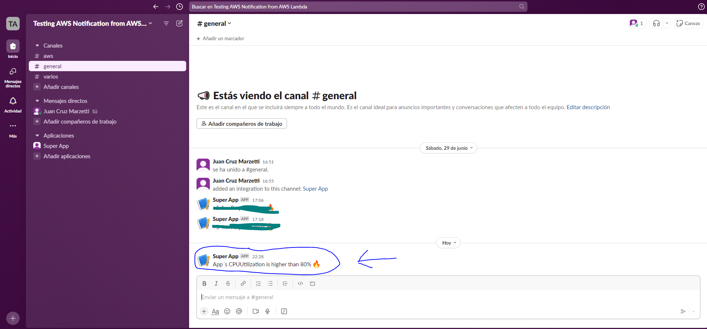

# Demo:


## Español

Configuración de Nivel Gratuito para Monitorear la Utilización de CPU de una Instancia AWS EC2. SNS notifica al correo asociado y al canal de chat #general de Slack.

### Ejecución

1. Personalizar credenciales en AWS CLI y contar con Terraform CLI.

2. Personalizar todos los valores de las variables de Terraform que se encuentran en `variables.tf`. Hacerlo en un archivo con extensión `.tfvars` en el directorio `terraform`.

3. Personalizar el valor de la URL del Webhook de Slack en el archivo `lambdafunction.py`.

4. Ubicarse en el directorio fuera de la carpeta `terraform` y ejecutar el siguiente comando:
   ```sh
   Compress-Archive -Path .\lambdafunction.py -DestinationPath lambda_function.zip
   ```
   Esto creará un archivo `.zip` de la función de Lambda que se encuentra en el archivo `lambdafunction.py` (archivo que subiremos a AWS Lambda).

5. Desplegar la infraestructura:
   ```sh
   cd terraform
   terraform init
   terraform plan --var-file variablevalues.tfvars
   terraform apply --var-file variablevalues.tfvars
   ```

### Destrucción

Para destruir la infraestructura, ejecutar el siguiente comando:
```sh
terraform destroy --var-file variablevalues.tfvars
```

### Pruebas

1. Conectarse mediante SSH desde la Consola de PowerShell como administradores a la instancia EC2 creada:
   ```sh
   ssh -i ~/.ssh/id_rsa ubuntu@your-instance-public-ip
   ```
   (Reemplazar `your-instance-public-ip` por la IP Pública de la instancia EC2 que creamos).
   Tip: donde dice "ubuntu" es un usuario que puede variar en las distribuciones de Linux/Unix dependiendo de la AMI, suele ser "ec2-user", "ubuntu" o "debian".

2. En el comando anterior debemos contar con nuestro par de claves ssh-keygen. En nuestro archivo `keypair.tf` especificamos el nombre del par de claves y la clave la especificamos como nuestras llaves SSH Keygen (también se podría hacer con un archivo .pem en vez de este tipo de llaves). Si no contamos con claves SSH Keygen, las podemos generar fácilmente. ¿Cómo comprobarlo? Debemos ejecutar (desde Bash) el comando:
   ```sh
   cd ~/.ssh
   ```
   Seguido de:
   ```sh
   ls
   ```
   Si la carpeta no existe o está vacía, es porque no contamos con claves SSH-Keygen y debemos generarlas. Al generarlas, automáticamente se guardarían en este directorio.

3. Una vez dentro de la instancia EC2, ejecutar:
   ```sh
   sudo apt update
   sudo apt install stress
   stress -c 1 -t 1800s
   ```
   Esto generará un gran uso de CPU de la instancia EC2 durante 1800 segundos, con lo cual si la alarma funciona, debería enviarnos una notificación al chat #general de Slack y otra notificación a nuestro correo asociado con la alarma.
   PD: el "update" es porque algunas AMIs no estan actualizadas con paquetes como lo son por ejemplo stress.
   PD2: estos comandos pueden variar dependiendo la AMI. En este ejemplo se hacen con la AMI de la instancia que es una Debian.

---

## English

Free Tier Configuration for Monitoring the CPU Utilization of an AWS EC2 Instance. SNS notificates to the associated mail and Slack´s #general chat channel

### Execution

1. Customize credentials in AWS CLI. Have Terraform CLI.

2. Customize all Terraform variable values found in `variables.tf`. Do this in a file with a `.tfvars` extension in the `terraform` directory.

3. Customize the Slack Webhook URL value in the `lambdafunction.py` file.

4. Navigate to the directory outside the `terraform` folder and run the following command:
   ```sh
   Compress-Archive -Path .\lambdafunction.py -DestinationPath lambda_function.zip
   ```
   This will create a `.zip` file of the Lambda function found in the `lambdafunction.py` file (a file that we will upload to AWS Lambda).

5. Deploy the infrastructure:
   ```sh
   cd terraform
   terraform init
   terraform plan --var-file variablevalues.tfvars
   terraform apply --var-file variablevalues.tfvars
   ```

### Destruction

To destroy the infrastructure, run the following command:
```sh
terraform destroy --var-file variablevalues.tfvars
```

### Testing

1. Connect via SSH from the PowerShell console as administrators to the created EC2 instance:
   ```sh
   ssh -i ~/.ssh/id_rsa ec2-user@your-instance-public-ip
   ```
   (Replace `your-instance-public-ip` with the Public IP of the EC2 instance we created).

2. In the previous command, we need to have our ssh-keygen key pair. In our `keypair.tf` file, we specify the name of the key pair, and we specify the key as our SSH Keygen keys (it could also be done with a .pem file instead of this type of keys). If we don't have SSH Keygen keys, we can easily generate them. How to check? We must run (from Bash) the command:
   ```sh
   cd ~/.ssh
   ```
   Followed by:
   ```sh
   ls
   ```
   If the folder does not exist or is empty, it means that we do not have SSH-Keygen keys and we need to generate them. When generated, they will automatically be saved in this directory.

3. Once inside the EC2 instance, run:
   ```sh
   sudo apt update
   sudo apt install stress
   stress -c 1 -t 1800s
   ```
   This will generate high CPU usage of the EC2 instance for 1800 seconds, so if the alarm works, it should send us a notification to the #general Slack chat and another notification to our email associated with the alarm.
